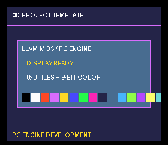

# Example 00: project template



**Project:** Run `make` in this folder to build `build/00-project-template.pce` with the bundled LLVM-MOS setup. This HuCard ROM can run in a PC Engine emulator. CD-ROM² deployment needs project-specific IPL/disc packaging and a user-supplied System Card BIOS.

**Files:** `src/main.c` contains the topic-specific C sample; `src/demo_video.c` and `src/demo_video.h` provide the small SDK-backed screen fixture; `assets/demo_assets.h` contains its embedded tile/palette data, and `assets/source.png` previews its source artwork, generated by `../tools/generate_graphics.py`. `assets/screenshot.png` is captured from the built ROM in the headless emulator. See additional files in this folder for topic-specific data.

Use this layout when starting a small Arcade CD-ROM² application. Names below
are suggested organization, not compiler-required paths.

```text
project/
  Makefile
  README.md
  boot/                 IPL entry and boot/linker configuration
  src/                  game and hardware-adapter code
  include/              project contracts and generated asset declarations
  linker/               IPL, application, and bank placement scripts
  assets/source/        authored art, maps, audio, and file manifest
  tools/                deterministic asset and disc-image builders
  tests/                headless boot, transfer, visual, audio, and gameplay checks
  build/                generated files only; never the source of truth
  tools/                copied LLVM-MOS bootstrap and BIOS check helpers
```

Start with the [starter Makefile](../starter/Makefile) and copy all files from
[`starter/tools/`](../starter/tools/) into the new project's `tools/` directory.
The Makefile include uses `mos-pce-clang` from `PATH` when available; otherwise
it downloads and installs SDK 23.2.0 under the user's local data directory,
then exports that SDK's `bin` directory to Make recipes and child processes.
Keep `toolchain` as a prerequisite of every compile, assemble, and link rule.
Run `make bios-check` before a CD boot; if the System Card BIOS is missing, the
target prints the user-local folder where it should be placed.

Keep the platform boundary small and explicit. Implement operations like
`read_cd_extent`, `copy_to_arcade_ram`, `arcade_ram_to_vram`, `set_palette`,
`begin_sat`, `publish_frame`, and `read_input` using the real SDK. These names
describe a contract only; verify the installed API before writing calls.

Minimal control-flow example (**pseudocode**):

```c
int main(void) {
    if (!platform_boot()) fatal_boot_screen();
    if (!video_init()) fatal_video_screen();
    if (!load_start_screen_assets()) fatal_asset_screen();
    draw_start_screen();
    publish_complete_frame();
    for (;;) {
        wait_for_frame_boundary();
        read_input();
        update_game_state();
        build_next_frame();
        publish_complete_frame();
    }
}
```

The first milestone is a new boot from power/reset into a visible screen with a
known palette and a changing heartbeat or input response. Keep a visible
failure screen for unsupported BIOS/version, disc read error, missing extent,
bad asset manifest, Arcade Card detection failure, and linker/runtime mismatch.

## Build pipeline contract

1. Use one pinned LLVM-MOS PCE CD compiler (`mos-pce-clang`), headers,
   integrated assembler, libraries, and linker script. For a new project with
   no compiler on `PATH`, the starter Makefile bootstraps SDK 23.2.0.
2. Compile the IPL and application with separate, explicit memory layouts.
3. Generate assets from source files and write a manifest with names, byte
   lengths, sector extents, and checksums.
4. Build a disc image with the project's CD tool and verify each emitted
   extent against the generated file.
5. Inspect the linked image/map and a machine-readable memory report.
6. Run the headless boot check with a user-supplied compatible BIOS.

Do not put hand-edited generated outputs under `build/`. A source or manifest
change must reproduce them deterministically.

## Test ladder

Boot first. Then test each data boundary (disc to CPU staging, staging to
Arcade RAM, Arcade RAM to VRAM), followed by a static scene, one input path, one
actor, one sound path, and finally the full feature. Keep an isolated emulator
base directory for each test that can read saves/configuration. Record which
steps were seeded or forced. A screenshot of a BIOS does not prove the
application loaded.
