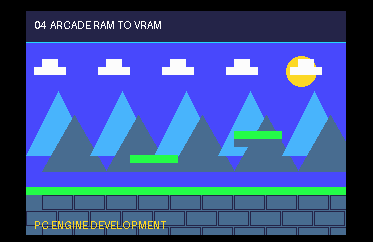

# Example 04: Arcade RAM to VRAM with block transfers



**Project:** Run `make` in this folder to build `build/04-aram-to-vram.pce` with the bundled LLVM-MOS setup. This HuCard ROM can run in a PC Engine emulator. CD-ROM² deployment needs project-specific IPL/disc packaging and a user-supplied System Card BIOS.

**Files:** `src/main.c` contains the topic-specific C sample; `src/demo_video.c` and `src/demo_video.h` provide the small SDK-backed screen fixture; `assets/demo_assets.h` contains its embedded tile/palette data, and `assets/source.png` previews its source artwork, generated by `../tools/generate_graphics.py`. `assets/screenshot.png` is captured from the built ROM in the headless emulator. See additional files in this folder for topic-specific data.

## Transfer contract

Before copying graphics, establish four facts from the selected hardware and
LLVM-MOS PCE CD SDK:

- Which Arcade Card port/register set provides sequential reads or writes.
- How its address registers encode the bank and offset, including carry.
- Which VDC port aliases must receive the alternating transfer bytes.
- Whether the VDC destination address counts bytes, words, or patterns.

Validate source and destination ranges with `scripts/calc.py` or
`scripts/bank_space.py`; don't let an out-of-range source wrap into unrelated
Arcade data or a destination overwrite the BAT/SAT/font.

## TAI/TIA block moves in the LLVM-MOS target

Use the instruction that matches the device's auto-increment behavior:

- `TII`: increment source and destination.
- `TDD`: decrement source and destination.
- `TIN`: fixed source, increment destination.
- `TIA`: increment source and alternate between two destination addresses.
- `TAI`: alternate between two source addresses, increment destination.

The alternating instructions suit mirrored I/O ports in some transfer loops.
For example, one source sequence can alternate between adjacent read mirrors
that both advance the Arcade Card address. A `TIA` loop can alternate
destination aliases of the VDC data port while Arcade data is read
sequentially. This depends on the actual port wiring and register shadow; it
is not a generic substitution rule.

## Safe transfer sequence

```text
arcade_to_vram(source, vram_word_address, byte_count):
    require byte_count fits source range
    require byte_count fits allocated VDC region
    save or preserve shared VDC index state
    select VDC VRAM write address atomically
    while bytes remain:
        copy a bounded block with the matching CPU instruction emitted by LLVM-MOS
        allow time-sensitive IRQs between blocks
        advance source and remaining-byte state
    restore expected VDC index shadow
```

Use the hardware manual for opcode behavior and LLVM-MOS assembler docs for
source syntax and instruction support. Establish a maximum burst from the active raster/IRQ deadline, then
measure the full loop. Keep the address setup atomic; do not mask interrupts
for a large transfer just to simplify the code.

## Verify the transfer path

Write a deterministic byte pattern in Arcade RAM, copy it, and read back VRAM
through a supported path or render it as a visible test tile. Include odd-size
rejection, source/destination boundaries, consecutive bursts, interrupts
between bursts, and simultaneous sound/raster load. Compare data, not just
whether the API returned success.
