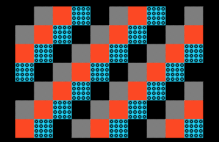

# Example 05: sound samples and music



**Project:** Run `make` in this folder to build `build/05-sound-samples.pce` with the bundled LLVM-MOS setup. This HuCard ROM can run in a PC Engine emulator. CD-ROM² deployment needs project-specific IPL/disc packaging and a user-supplied System Card BIOS.

**Files:** `src/main.c` contains the topic-specific C sample; `src/demo_video.c` and `src/demo_video.h` provide the small SDK-backed screen fixture; `assets/demo_assets.h` contains its embedded tile/palette data, and `assets/demo.svg` is the editable source artwork. `assets/screenshot.png` is captured from the built ROM in the headless emulator. See additional files in this folder for topic-specific data.

Choose the sound path deliberately. CD-DA uses disc tracks, BIOS ADPCM uses
the System Card's ADPCM memory/decoder, PSG DDA streams bytes to PSG channels,
and ordinary PSG effects program tone/noise registers. They have different
bandwidth, latency, storage, mixing, and concurrency rules.

## Sample bank and event table

Offline tooling should resample/encode source audio into the target format,
produce a sample table with semantic event name, storage bank/address, byte
length, decoder/rate mode where relevant, and optional loop boundaries. Store
checksums and a host preview beside the generated data. Validate boundaries
and sizes with the Python helper before emitting target tables.

## Runtime event start

```text
start_effect(event):
    descriptor = sample_table.lookup(event)
    validate_descriptor(descriptor)
    prepare_inactive_voice_record(descriptor)   # with IRQs enabled if safe
    briefly_mask_irq_if_publication_must_be_atomic()
    publish_voice_record()
    configure_required_PSG_or_ADPCM_registers()
    restore_irq_state()
```

This is pseudocode, not a drop-in API. Keep sample lookup, bank arithmetic,
and record initialization outside the short hardware critical section. A
timer-driven DDA routine must preserve any MPR mapping it borrows and finish
within the shared raster/audio schedule. Declare channel ownership and
replacement/priority policy; do not invent an allocator if the project uses
fixed channels.

## Music and data loading policy

Write down whether CD-DA playback can overlap data reads, whether ADPCM memory
can be rewritten while a voice plays, and which channels are reserved for
music/effects. Stop or pause the relevant path before a conflicting disc load.
Test the policy rather than relying on emulator silence.

## Tests

- Trigger each event alone; compare decoded/recorded output or hardware state.
- Trigger effects while music, raster IRQ, and gameplay updates are active.
- Exercise bank/window crossings, zero length, final loop byte, stop, and
  replacement by higher-priority effects.
- Test both worst-case timing and output content. A host WAV preview does not
  prove target playback or interrupt responsiveness.
