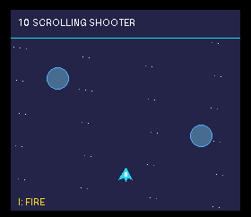

# Example 10: scrolling shooter



**Project:** Run `make` in this folder to build `build/10-shmup.pce` with the bundled LLVM-MOS setup. This HuCard ROM can run in a PC Engine emulator. CD-ROM² deployment needs project-specific IPL/disc packaging and a user-supplied System Card BIOS.

**Files:** `src/main.c` contains the topic-specific C sample; `src/demo_video.c` and `src/demo_video.h` provide the small SDK-backed screen fixture; `assets/demo_assets.h` contains its embedded tile/palette data, and `assets/source.png` previews its source artwork, generated by `../tools/generate_graphics.py`. `assets/screenshot.png` is captured from the built ROM in the headless emulator. See additional files in this folder for topic-specific data.

Represent waves as deterministic timed events, not hand-scattered code in the
main loop. Keep player, enemies, player shots, enemy shots, pickups, and
explosions in bounded pools. Separate spawn policy from draw admission so a
full visual budget can throttle later optional spawns instead of producing
invisible hazards.

## Update/draw outline

```text
update_frame(input):
    update_player(input)
    consume_due_wave_events()
    update_enemy_patterns_and_boss_phase()
    update_projectiles_and_collision()
    update_pickups_and_score()
    schedule_effects_with_visual_priority()

render_frame():
    enqueue_player_and_visible_hazards_first()
    enqueue_enemies_and_boss_parts()
    enqueue_optional_particles_last()
    publish_sat_background_and_hud_as_one_generation()
```

The calls are pseudocode. For collision, specify whether objects use points,
rectangles, or hitboxes tied to animation frames. Ensure that hitbox changes
follow pose and that refused graphics obey an explicit gameplay policy.

## Measure together

Budget object pools, collision loops, SAT entries, per-line sprite width,
patterns, Arcade RAM event data, audio interrupt work, and raster cost at the
same time. Profile the dense wave with every intended effect active, not just
the opening. Seeded tests should assert event advancement, collision,
projectile visibility, boss phase changes, defeat, and transition. Report what
was initialized by the harness and what the game itself executed.
