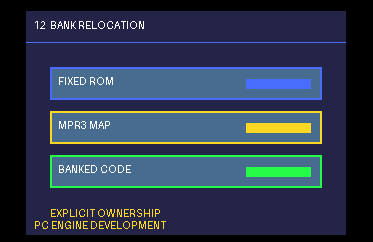

# Example 12: relocate code when a bank is full



**Project:** Run `make` in this folder to build `build/12-bank-relocation.pce` with the bundled LLVM-MOS setup. This HuCard ROM can run in a PC Engine emulator. CD-ROM² deployment needs project-specific IPL/disc packaging and a user-supplied System Card BIOS.

**Files:** `src/main.c` contains the topic-specific C sample; `src/demo_video.c` and `src/demo_video.h` provide the small SDK-backed screen fixture; `assets/demo_assets.h` contains its embedded tile/palette data, and `assets/source.png` previews its source artwork, generated by `../tools/generate_graphics.py`. `assets/screenshot.png` is captured from the built ROM in the headless emulator. See additional files in this folder for topic-specific data.

Suppose a linker report says the current code section does not fit. Do not pick
the bank with the largest free-byte number and move the function immediately.

## Safe workflow

1. Build the current tree and save the map, linker report, ROM image, and dirty-file
   list. Use `scripts/bank_space.py` to rank capacity and `scripts/calc.py` for
   requested byte/address calculations.
2. Identify the section macro, code and constant sections, callers, indirect
   callbacks, nested overlay calls, and runtime data accessed by the routine.
3. Determine which MPR/window maps the routine at every call site. Trace the
   return trampoline, stack, IRQ code, loader scratch, and any audio/raster
   path that borrows the candidate bank.
4. Exclude any destination already known to be a disc transfer window,
   decompressor/scratch area, work data, active callback, or code live during
   an overlapping operation. Reconsider it only after proving those uses
   cannot overlap every relevant code/data/caller lifetime. Unknown timing is
   not evidence of safety.
5. Move a small cohesive unit, update its section annotation and all
   bank-aware callers together, then link and inspect every section again.
6. Run a scenario that reaches all callers and overlaps the relevant loader,
   interrupt, and sound behavior. Check the return path and scene transitions.

In a short recommendation, state which bank the Python capacity report ranks
next, which known-reserved bank remains excluded, and that the new link/map plus
focused runtime regression are required before calling the move complete. Do
not repeat the arithmetic expression or infer safety from a free-byte number.

## Pseudocode reminder

```text
call_overlay(bank, function):
    old_mapping = read_active_mpr()
    map(bank, execution_window)
    call(function)
    restore(old_mapping)
```

This illustrates a common trampoline contract; it is pseudocode, not an
LLVM-MOS SDK API. Read the actual target implementation before using it. Function pointers alone do
not record which bank supplies their bytes.

The report answers “how many bytes are available?” The dependency/lifetime
trace answers “can this code run there without breaking another path?” Those
are separate questions.

`src/main.c` and `src/bank_worker.c` use the LLVM-MOS HuCard SDK's
`PCE_ROM_BANK_AT` declaration, `.rom_bank4` section, and explicit MPR3 mapping.
Review the active link map when adapting the bank placement.

The graphics demo reserves a fixed ROM window at 0x8000 through 0xffff.
Its worker therefore uses physical bank 4, outside that fixed allocation,
mapped into MPR3 at 0x6000.
