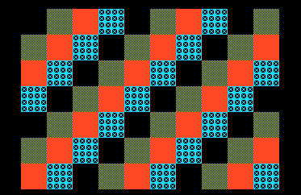

# Example 13: headless emulator and MCP debugging

**Project:** Run `make` in this folder to build `build/13-headless-debugging.pce`
with the bundled LLVM-MOS setup. The result is a HuCard preview. CD-ROM²
deployment needs the project's IPL/disc packaging and a user-supplied System
Card BIOS.

**Files:** `src/main.c` contains the topic-specific C sample; `src/demo_video.c`
and `src/demo_video.h` provide the screen fixture; `assets/demo_assets.h`
contains generated tile/palette data. The screenshot is captured from a bounded
headless run.

The skill bundle includes a licensed PCE headless source snapshot, MCP wrapper,
and headless build notes under `third_party/`. It does not include a compiled
binary, game ROM/disc, or BIOS. Use the project Make targets for emulator
selection and arguments; do not put executable names or direct launch commands
into local coding-agent prompts.

## Standard project checks

1. Use `make run` for a neutral boot capture and `make debug` for the same run
   with logical-PC coverage. Both targets isolate the emulator's save/config
   directory and print the image/capture paths.
2. Run `make bios-check` before a CD boot. If no System Card path is configured,
   it prints the user-local firmware folder and the `PCE_SYSTEM_CARD_BIOS`
   setting to use. Never include firmware in a public skill bundle.
3. If an MCP server is already configured by the host, inspect its live
   `tools/list` response. The current wrapper includes a deterministic
   `run_platformer_scenario` tool in addition to run/status/disassembly/memory/
   screenshot/coverage/video operations.
4. For a platformer, publish P2TR v1 from real update and render state and run
   `make trace` with the current symbol address and an input scenario. See
   [`../../references/platformer-rules.md`](../../references/platformer-rules.md).

Neutral frames do not prove movement, jumping, landing, collision, or goal
behavior. State which scenario reached each gameplay condition. Coverage counts
logical CPU addresses and may alias banked code. A screenshot is visual
evidence; P2TR is game-authored state evidence. Neither is physical-console
timing evidence.
