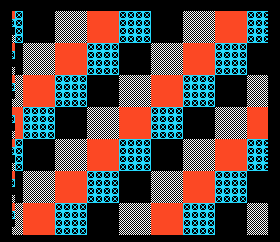

# Example 17: stream a scrollable background

**Project:** Run `make` in this folder to build `build/17-scrollable-background.pce` with the bundled LLVM-MOS setup. This HuCard ROM can run in a PC Engine emulator. CD-ROM² deployment needs project-specific IPL/disc packaging and a user-supplied System Card BIOS.

**Files:** `src/main.c` contains the topic-specific C sample; `src/demo_video.c` and `src/demo_video.h` provide the small SDK-backed screen fixture; `assets/demo_assets.h` contains its embedded tile/palette data, and `assets/demo.svg` is the editable source artwork. `assets/screenshot.png` is captured from the built ROM in the headless emulator. See additional files in this folder for topic-specific data.

For a 256-dot platform viewport, Saber Rider keeps a 64 by 32 BAT and a 256-dot screen window. The scene map is stored in Arcade RAM as columns. Each column has a pattern ID and palette for every map row. A 33-column CPU-side ring tracks the columns currently assigned to the BAT: the visible 32 columns plus one edge column for the next camera step.

The renderer computes the desired world column from the camera, reads only columns that entered view, finds or uploads their patterns, writes the corresponding BAT column, then updates BXR. Repeated pattern IDs are reused through a directory in Arcade RAM. This avoids uploading a full map every frame.

## Cache lifetime at the VBlank boundary

A column that scrolled off the left side still supplies pixels until the VBlank that applies the next scroll register value. Saber Rider therefore marks its tile slots as held when releasing the outgoing column. It does not reuse them for the incoming column in the same frame. The slots become available after the next presentation boundary. Reusing them early caused brief columns of unrelated graphics when the cache was nearly full.

Publish a background scroll and its matching SAT as one frame generation. The game holds the hardware scroll until SAT upload finishes, then releases it so VBlank presents both together. This prevents a player sprite from moving against a background from the prior camera position.

## Frame flow

    update_camera_from_world_position()
    identify_entering_map_columns()
    read_column_metadata_from_expansion_ram()
    upload_missing_patterns_to_unreferenced_vram_slots()
    write_bat_column_and_update_reference_counts()
    retain_outgoing_slots_until_vblank()
    submit_sat_for_the_same_camera_position()
    release_scroll_for_vblank_publication()

The sequence is pseudocode. Define address units, row stride, cache ownership, and failure behavior from the selected SDK. On CD read or Arcade Card transfer failure, keep the prior valid frame or show a controlled error screen; do not publish BAT references to missing patterns.

## Useful invariants

- The BAT can reference only patterns that are already resident in VRAM.
- A cached pattern slot remains unavailable while any visible BAT column refers to it.
- A slot released during scrolling remains held until the VBlank that removes its last visible reference.
- Collision data and visual pattern cache have different lifetimes. Replacing a graphic must not discard collision rows still needed by the world update.
- Camera movement changes screen coordinates, not world coordinates.

The reference renderer is Saber Rider's video_background() and column_load() in src/platform/pce/video_pce.c. The stage map and pattern payloads are baked by tools/pce/build_assets.py; the public picture.py tool covers static screens, not this streamed archive format.

The compact `src/main.c` example streams synthesized columns into the BAT as
the camera advances. It demonstrates VDC column-write setup; it does not include
Saber Rider's Arcade RAM archive, pattern cache, or VBlank reference-count
handoff.
