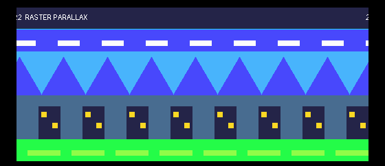

# Example 22: parallax from raster scroll bands

**Project:** Run `make` in this folder to build `build/22-raster-parallax.pce` with the bundled LLVM-MOS setup. This HuCard ROM can run in a PC Engine emulator. CD-ROM² deployment needs project-specific IPL/disc packaging and a user-supplied System Card BIOS.

**Files:** `src/main.c` contains the topic-specific C sample; `src/demo_video.c` and `src/demo_video.h` provide the small SDK-backed screen fixture; `assets/demo_assets.h` contains its embedded tile/palette data, and `assets/source.png` previews its source artwork, generated by `../tools/generate_graphics.py`. `assets/screenshot.png` is captured from the built ROM in the headless emulator. See additional files in this folder for topic-specific data.

Saber Rider's second race phase uses the 512-dot mode from the previous example. Its sky has far and near horizontal scroll values, while the road receives a new horizontal offset for successive scanline pairs. A VBlank handler installs the far-sky BXR and schedules the first raster interrupt. At scanline 80 the HBlank handler installs the near-sky BXR; at scanline 112 it starts the road band. The road handler then reads the frame's precomputed per-line offsets and wrap-copy selection.

This is not three independent background planes. The asset bake places sky and road patterns in one BAT layout. Raster-time BXR/BYR writes select different windows into that map at chosen vertical bands. The sky scroll calculations are in road_pce.c; the HBlank schedule and register writes are in irq.S.

## Safe implementation shape

1. Compose the sky and road into a single BAT/character allocation, with each band and any wrap copies placed deliberately.
2. Compute far, near, and road scroll tables before the frame is presented. Use a back page while the IRQ consumes the current page.
3. At VBlank, latch the prepared page and set the far-sky registers and first raster-counter position.
4. At each raster boundary, write only the registers required for the next band. Restore the expected VDC register index before leaving the IRQ.
5. Swap to the next table page only at VBlank; do not modify the page an IRQ may still be reading.

Keep the raster handler bounded. Avoid disk or Arcade Card reads, palette fitting, division, or general game logic in HBlank. Precompute camera transforms, per-line offsets, and copy choices during the main frame update.

## Debugging clues

- A single-line seam usually means the VDC applies the new register one line later than the table assumes.
- A jump at a page boundary usually means VBlank and HBlank disagree about which table half is active.
- A 256-dot map incorrectly reused in 512 mode may show repeats because its BAT width and wrap copies do not cover the wider viewport.
- A cloud moving with the road indicates a shared scroll value or bad band transition, not missing hardware planes.

The exact schedule described here is the Saber Rider road renderer, not a generic parallax engine. See video_race_init() and race_sky_load() in src/platform/pce/video_pce.c, road table construction in road_pce.c, and VBlank/HBlank code in irq.S.

`src/demo_video.c` contains the example's small VDC IRQ handler; it schedules
three fixed scroll-band changes. `src/main.c` enables that path. Replace the
fixture offsets with scene data and budget the handler against the active raster
work before adding it to a game.
